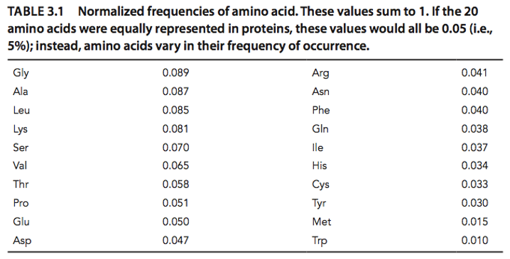

[](https://classroom.github.com/a/0fjjJvco)
# hw1. generate PAM<sub>x</sub> matrix
* Khoo Kim Jun
* 110304027

## Description

* Writing Python program to generate PAM<sub>x</sub> from the given mutation probability matrix.
* PAM<sub>x</sub> must be as a log odds and complete square matrix (rounding to integer), not the format of the given mutation probability matrix.
* Creating your own program, i.e., hw1.py, to read mut.txt and *x*, then output pamx.txt.

* You need to write your program as a function named generate_pam. i.e.,
```
import numpy as np
import pandas as pd

# Define the normalized frequencies of amino acids based on the provided table
# Order: A, R, N, D, C, Q, E, G, H, I, L, K, M, F, P, S, T, W, Y, V
amino_acid_frequencies = {
    'A': 0.087, 'R': 0.041, 'N': 0.040, 'D': 0.047, 'C': 0.033,
    'Q': 0.038, 'E': 0.050, 'G': 0.089, 'H': 0.034, 'I': 0.037,
    'L': 0.085, 'K': 0.081, 'M': 0.015, 'F': 0.040, 'P': 0.051,
    'S': 0.070, 'T': 0.058, 'W': 0.010, 'Y': 0.030, 'V': 0.065
}

def generate_pam(x, input_path, output_path):
    # Read the input mutation matrix, skipping the comment line and using space as separator
    mut_matrix = pd.read_csv(input_path, sep='\s+', skiprows=1, index_col=0)
    print(f"Shape of the input matrix after reading: {mut_matrix.shape}")  # Debugging print statement
    print(mut_matrix.head())  # Display the first few rows for verification

    # Extract the index and columns before converting to NumPy array
    row_index = mut_matrix.index
    col_index = mut_matrix.columns    

    # Convert mutation matrix to a numpy array and divide by 10,000 as per instruction
    mut_matrix = mut_matrix.values / 10000

    # Normalize the mutation matrix
    # row_sums = mut_matrix.sum(axis=1)
    # norm_matrix = mut_matrix / row_sums[:, np.newaxis]

    # Multiply the normalized matrix 'x' times to get PAMx
    pam_matrix = np.linalg.matrix_power(mut_matrix, x)

    # Calculate the log-odds matrix
    # Reorder the frequencies based on the row and column indices of the matrix
    frequencies = np.array([amino_acid_frequencies[aa] for aa in row_index])
    
    # Calculate R_ij = M_ij / f_i (observed change divided by frequency of the amino acid)
    R_matrix = pam_matrix / frequencies[:, np.newaxis]

    # Log-odds calculation: 10 * log10(R_matrix)
    log_odds_matrix = 10 * np.log10(R_matrix)
    log_odds_matrix[np.isneginf(log_odds_matrix)] = 0  # Handle -inf values
    log_odds_matrix = np.nan_to_num(log_odds_matrix, nan=0)  # Replace NaNs with 0
    log_odds_matrix = np.round(log_odds_matrix).astype(int)  # Round to nearest integer

    # Create a DataFrame to store the output matrix using original indices and column names
    pam_df = pd.DataFrame(log_odds_matrix, index=row_index, columns=col_index)

    # Save to output file with the correct format
    try:
        pam_df.to_csv(output_path, sep='\t', index=True, header=True)
        print(f"Output written successfully to {output_path}")
    except Exception as e:
        raise IOError(f"An error occurred while writing to the output file: {e}")

# Example usage:
generate_pam(5, 'mut.txt', 'pam5.txt')
generate_pam(10, 'mut.txt', 'pam10.txt')
generate_pam(100, 'mut.txt', 'pam100.txt')
generate_pam(150, 'mut.txt', 'pam150.txt')
generate_pam(250, 'mut.txt', 'pam250.txt')

# ChatGPT, respond to my prompt on Obtober 6, 2024
# "please read this file and provide me the code to get the hw done"
# "how to make sure the compiler can read the provided file" 
# "the code can be run successfully but the resulting matrix is not correct according to the hints"
# unfortunately conversation link unable to provide 
# as the current version is not supporting the conversation with uploaded image

```
* Upload your code 'hw1.py' to Gradescope under the course ID:**8K4V8V**.
* Packages you can use: numpy, pandas

### HINTs
* PAM<sub>x</sub> is a symmetric matrix even though the given mutation probability matrix is not.
* The mutation matrix should be divided by 10,000 before calculation PAM250. The value in the matrix should be in [0,1].
* Normalized frequencies of amino acids (<I>f<sub>i</sub></I>) credit by [Bioinformatics and Functional Genomics 3rd edition](https://www.wiley.com/en-us/Bioinformatics+and+Functional+Genomics,+3rd+Edition-p-9781118581780) 


## Parameters

* x: parameter of pam
* input_path: input file path
* output_path: output file path


## Files

* mut.txt: the input mutation probability matrix, M<sub>1</sub>
* pam250.txt: the output generated by generate_pam(250, 'example/mut.txt', 'example/pam250.txt'). The output format must be identical to the one of pam250.txt.


## Evaluation

There are 10 testing data (5 public, 5 private). 
* Correct answer gets 10 points for each testing data.


### Penalty

* If your code is similar to others and lacks detailed comments, you may lose up to 10 points or possibly receive a zero.

## References
Please provide the code along with its reference. For example, you can cite it as: ```# ChatGPT, respond to “your prompt,” on February 16, 2023```. Below is an example of a reference format summarizing the use of ChatGPT for R programming

>You are the R Language expert.
>Please help me to write a function call “k_fold” .
>Using given dataset to train the random forest model, and use the k-fold cross- validation to evaluate the best model parameters. Here is the instruction of the function requirements:\
>Function name: k_fold\
>Function parameters:
>1. k: the number of how much fold to split the dataset doing the k-fold cross- validation.
>2. input_file: input csv file path.
>3. output_file: output path of k-fold cross-validation result.
